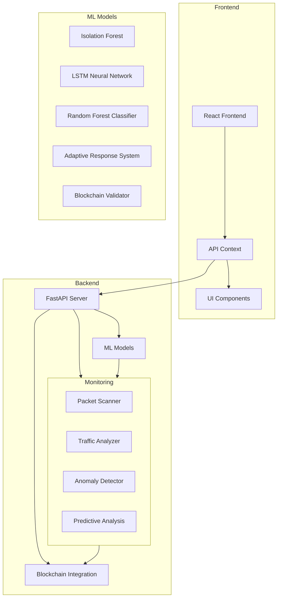
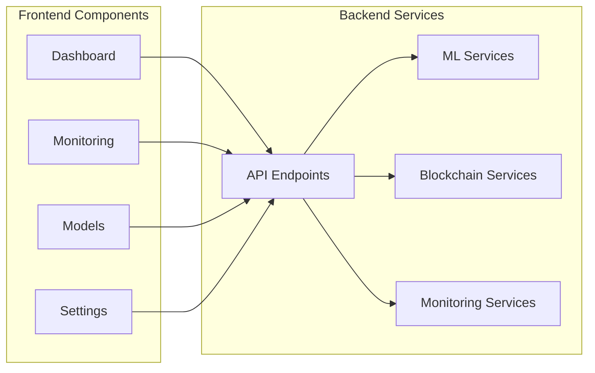

# DDoS Defense System

A comprehensive DDoS defense system that combines machine learning, blockchain technology, and adaptive response mechanisms to protect against distributed denial of service attacks.

## Architecture Overview

### System Architecture


### Component Architecture


## Features

### 1. Real-time Monitoring
- Packet scanning and analysis
- Traffic pattern detection
- Anomaly detection
- Real-time threat level assessment

### 2. Machine Learning Models
- Isolation Forest for anomaly detection
- LSTM Neural Network for attack prediction
- Random Forest Classifier for attack type classification
- Adaptive Response System for dynamic mitigation
- Blockchain Validator for attack pattern sharing

### 3. Blockchain Integration
- Immutable attack record storage
- Attack pattern sharing across networks
- Consensus-based validation
- Smart contract-based automation

### 4. Adaptive Response
- Dynamic mitigation strategies
- Real-time response adjustment
- Multiple mitigation techniques
- Performance optimization

### 5. Predictive Analysis
- Attack probability prediction
- Trend analysis
- Pattern recognition
- Early warning system

## Technology Stack

### Frontend
- React
- TypeScript
- Material-UI
- Axios
- React Router

### Backend
- FastAPI
- Python
- TensorFlow
- Web3.py
- Prometheus

### Machine Learning
- Isolation Forest
- LSTM Neural Network
- Random Forest Classifier
- Adaptive Response System

### Blockchain
- Ethereum
- Smart Contracts
- Web3 Integration
- IPFS (for pattern sharing)

## Getting Started

### Prerequisites
- Python 3.8+
- Node.js 14+
- Ethereum node (for blockchain features)
- TensorFlow 2.x

### Installation

1. Clone the repository:
```bash
git clone https://github.com/yourusername/ddos-defense.git
cd ddos-defense
```

2. Install backend dependencies:
```bash
cd backend
pip install -r requirements.txt
```

3. Install frontend dependencies:
```bash
cd frontend
npm install
```

4. Start the backend server:
```bash
cd backend
uvicorn main:app --reload
```

5. Start the frontend development server:
```bash
cd frontend
npm start
```

## Configuration

### Backend Configuration
The backend configuration can be modified in `backend/config.py`:
- API endpoints
- ML model parameters
- Blockchain connection settings
- Monitoring thresholds

### Frontend Configuration
Frontend configuration is available in `frontend/src/config.ts`:
- API endpoints
- UI settings
- Theme configuration

## API Documentation

### Monitoring Endpoints
- `GET /monitoring/status` - Get current monitoring status
- `POST /monitoring/start` - Start monitoring
- `POST /monitoring/stop` - Stop monitoring
- `GET /monitoring/attack-types` - Get available attack types
- `POST /monitoring/alert-thresholds` - Update alert thresholds

### ML Model Endpoints
- `GET /models/status` - Get ML models status
- `POST /models/train` - Train ML models
- `GET /models/predictions` - Get model predictions

### Blockchain Endpoints
- `GET /blockchain/status` - Get blockchain connection status
- `POST /blockchain/record` - Record attack event
- `GET /blockchain/patterns` - Get shared attack patterns

## Contributing

1. Fork the repository
2. Create your feature branch (`git checkout -b feature/AmazingFeature`)
3. Commit your changes (`git commit -m 'Add some AmazingFeature'`)
4. Push to the branch (`git push origin feature/AmazingFeature`)
5. Open a Pull Request

## License

This project is licensed under the MIT License - see the [LICENSE](LICENSE) file for details.

## Acknowledgments

- Material-UI for the component library
- FastAPI for the backend framework
- TensorFlow for ML capabilities
- Web3.py for blockchain integration 